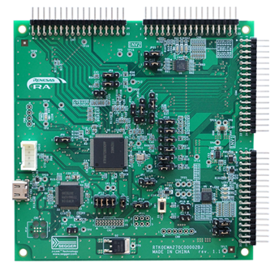

# Target CPU Board

## RA6T2

The target CPU Board for this sample program is the RA6T2 CPU Board, MCB-RA6T2 Version 2, manufactured by Renesas.

Part number : RTK0EMA270C00002BJ*1

MCU product code : RA6T2, R7FA6T2BD3CFP

Note *1 Please note that RTK0EMA270C00000BJ is not supported
