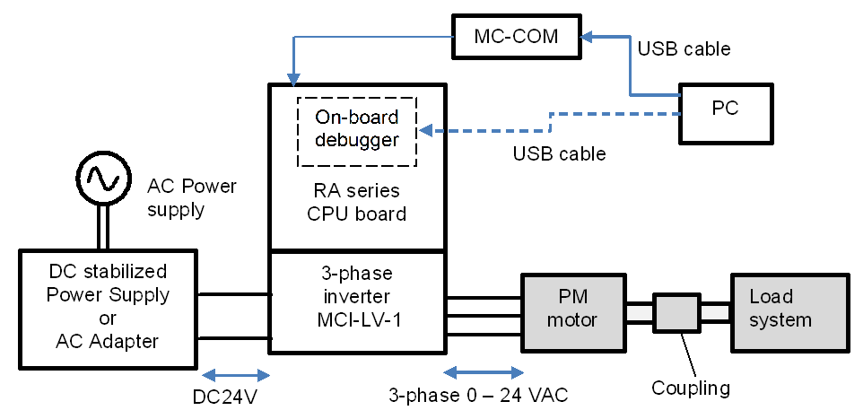

# Configuring a Hardware Environment

## Overview of Hardware Environment

This section describes the hardware environment in which a PM motor is operated by using this sample program. Figure below shows an example of the hardware configuration.

In the following paragraphs, the power supply, the motor and load system and the inverter, are described in detail. The CPU board is described in another section.

## Preparing a Power Supply

In this sample program, DC stabilized power supply/AC adapter/a control power supply (capable of output of 24V, 2.5A or more) is used to supply a voltage of 24 VDC to the 3-phase inverter MCI-LV-1.

The voltage supplied to the inverter varies depending on the inductive voltage, rating conditions, maximum load conditions of the motor to be used. Please select an appropriate type of power supply based on your experimental environment and restrictions and conditions of AC power supply to be used.

The inverter introduced here has an output current of 10A max. Please note that if the motor is changed, the rated operation may not be possible due to the rating of the new motor.

## Preparing a Motor

Before connecting the inverter to a motor, obtain the parameters and constants of the PM motor that are required to drive the motor with sensorless vector control by using a measuring instrument such as an LCR meter. In addition, contact the manufacturer of the PM motor to obtain the parameter information as required.

If motor parameters are changed, the following parameters for the current regulator, speed regulator, and sensorless control should be changed accordingly.

- Rated values (current, voltage, speed, and number of pole pairs)

- Ld, Lq, and resistance values

- Inductive voltage and magnetic flux linkage

- Moment of inertia of the motor and the load system connected to the
  motor shaft

Table below shows the parameters of the R42BLD30L3 motor from MOONS', which we investigated. Some of the parameters are based on our own measurements and may vary between individual motors and depending on the measurement conditions. The accuracy of these parameters or performance of the motor is not guaranteed. Note that the magnetic saturation caused by the load current may change the motor parameter values during operation, thus affecting the position estimation accuracy or operational performance.

| Parameter                       | Value (unit)                                                  |
| ------------------------------- | ------------------------------------------------------------- |
| Primary resistance R            | 1.3 Ω                                                         |
| d-axis inductance               | 1.3 mH                                                        |
| q-axis inductance               | 1.3 mH                                                        |
| Moment of inertia               | 0.000003666 kgm2                                   |
| Magnetic flux linkage Ψ         | 0.01119 Wb (rms)                                              |
| Number of pole pairs            | 4 (8 poles)                                                   |
| Rated speed                     | 4000 rpm                                                      |
| Maximum speed                   | 4500 rpm                                                      |
| Rated torque and maximum torque | 0.08 Nm and 0.16 Nm                                           |
| Rated frequency                 | 266.67 Hz (electrical angle)  66.67 Hz (mechanical angle) |
| Rated voltage                   | 36 V                                                          |
| Rated current                   | 1.67 Arms                                                     |
| Rated output power              | 30 W                                                          |

## Preparing a Load System

Evaluation of the control of the inverter and motor requires acquisition of the output characteristics and a load system is required. The user should prepare the load system. Select a load system that can be connected to the target motor for evaluation and couple it to the motor. In addition, connect a torque and speed meter that can measure the torque and speed between the load system and motor so that accurate torque and speed characteristics can be obtained.

For continuous testing, using a regenerative load tester is recommended to enable feedback to the inverter under testing. Before using a load tester that uses a particle brake or a hysteresis brake, check the restrictions on continuous operation.

## Preparing an Inverter

Note the following information when preparing an inverter. This sample program is configured for the MCI-LV-1 inverter board and must be changed if you use another inverter.

In sensorless vector control, the magnetic pole position is estimated by using the current detection value input from the current sensor. Therefore, the control performance is greatly influenced by the performance of the sensor itself and the accuracy and variations of the circuits that serve as paths for the signals output from the sensor. When selecting an inverter, careful consideration must be given to the design of the inverter:

- Rated capacity (kVA)

- Dead time value (μs)

- Type, characteristics, and signal specifications of the current sensor

- Characteristics data of the current sensor including gain and offset values, relationship between the current and voltage, and linearity of the signals

- Characteristics data of the voltage sensor including gain and offset values and linearity of the signals

In addition, MCI-LV-1 has a board user interface (board UI) that allows the user to operate motor control commands. Table below shows the list of components and functions of the board UI.

| Item                       | Interface components | Function                                                                           |
| -------------------------- | -------------------- | ---------------------------------------------------------------------------------- |
| Rotational position/ speed | Volume (VR1)         | Rotation speed command value input (analog value)                                  |
| START / STOP               | Toggle switch (SW1)  | Motor rotation start/ stop command                                                 |
| ERROR RESET                | Puch switch (SW2)    | Command to recover from an error status (when an error occurs)                     |
| LED1                       | Orange LED           | <ul><li>At the time of motor rotation : ON</li><li>At the time of stop : OFF</li></ul>              |
| LED2                       | Orange LED           | <ul><li>At the time of error detection : ON</li><li>At the time of normal operation : OFF</li></ul> |
| RESET                      | Push switch (RESET1) | System reset                                                                       |

