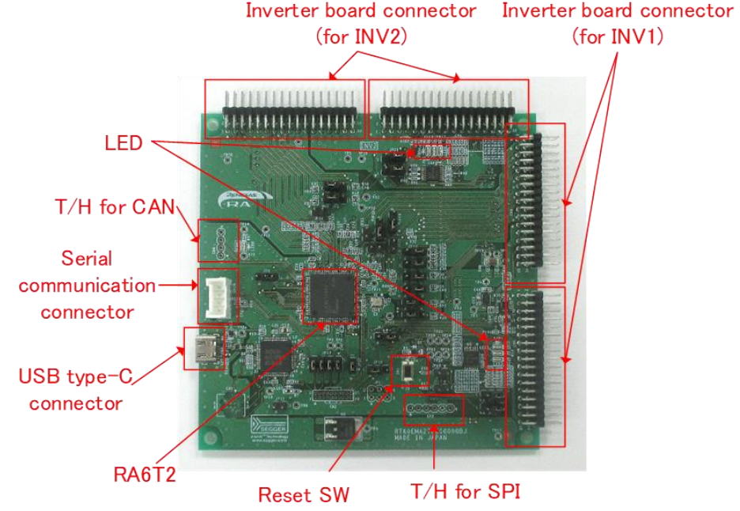

# Setting Up RA6T2 CPU Board

This section describes the RA6T2 CPU Board and its connectors, which can be connected to the inverter board, MCI-LV-1, directly. The connector indicated as "Inverter board connect (for INV1)" in the figure below should be mated to connectors on the MCI-LV-1.

