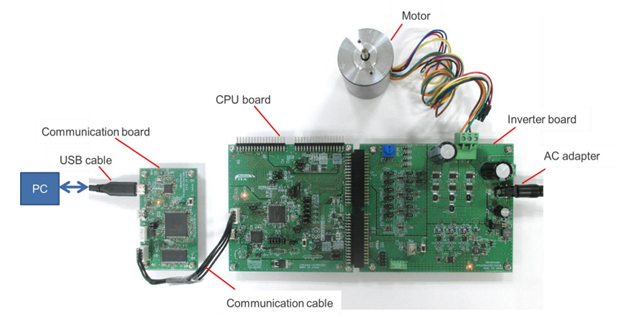

# Connection Example of Kit

Figure below shows an example of a CPU Board in combination with an inverter board kit (MCI-LV-1) and a communication board kit (MC-COM, model name : RTK0EMXC90Z00000BJ).

