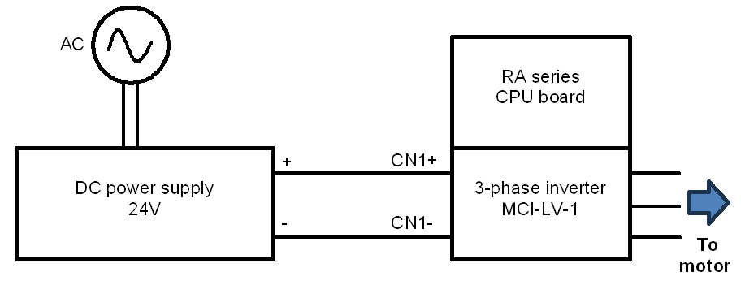
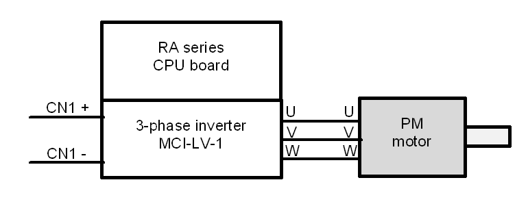
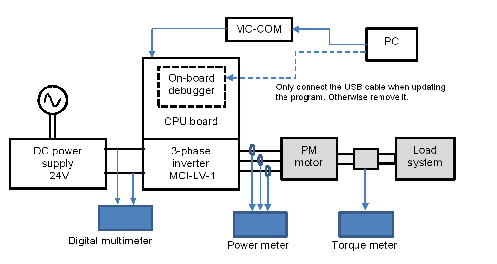

# On-board Debugger

The RA series CPU board includes the on-board debugger circuit, J-Link OB (JLOB). Updating of program is performed through JLOB. To perform program update, please connect the CPU board and your PC via a USB cable. The USB connector on RA series CPU board is indicated as “USB Type-C connector” or “USB connector for J-link On-board” in diagrams showing the CPU Board setup.

# Wiring and Connection

This section describes how to do the wiring between the power supply, inverter, and motor. Terminal names vary depending on the devices used, so be sure to refer to the instruction manuals of the devices to check the contents and specifications before doing the wiring. 

Figure below shows an example of wiring between the power supply and the inverter. Here, the output terminals of the regulated DC power supply are connected to the P and GND terminals of the inverter. Be careful not to connect with the wrong polarity. 

Figure below shows an example of wiring between the inverter and the motor.

# Using Measuring Instruments

To perform a detailed analysis of the sensorless control of an inverter and a permanent magnet (PM) motor, the following equipment can be utilized:

- Power meter

- Digital multimeter

- Torque meter

- External encoder

Depending on user's environment, required measurement accuracy and target performance specifications, the appropriate measuring instrument should be used.

