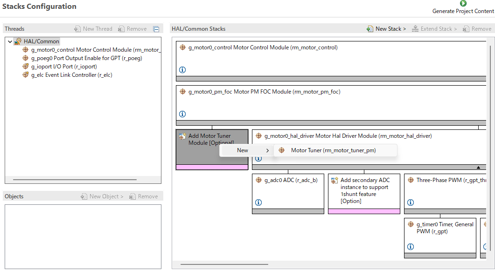
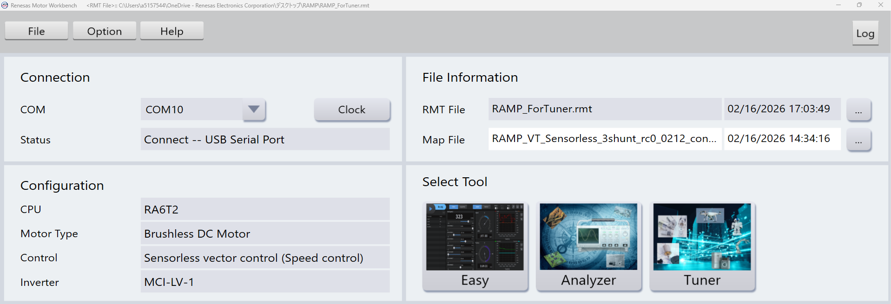
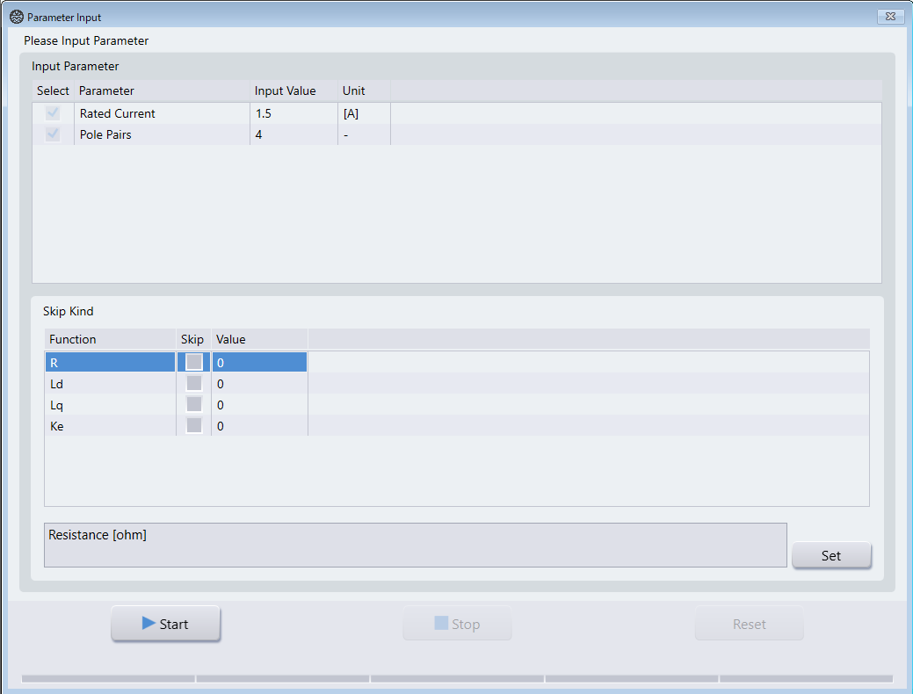
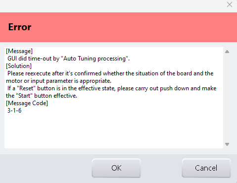
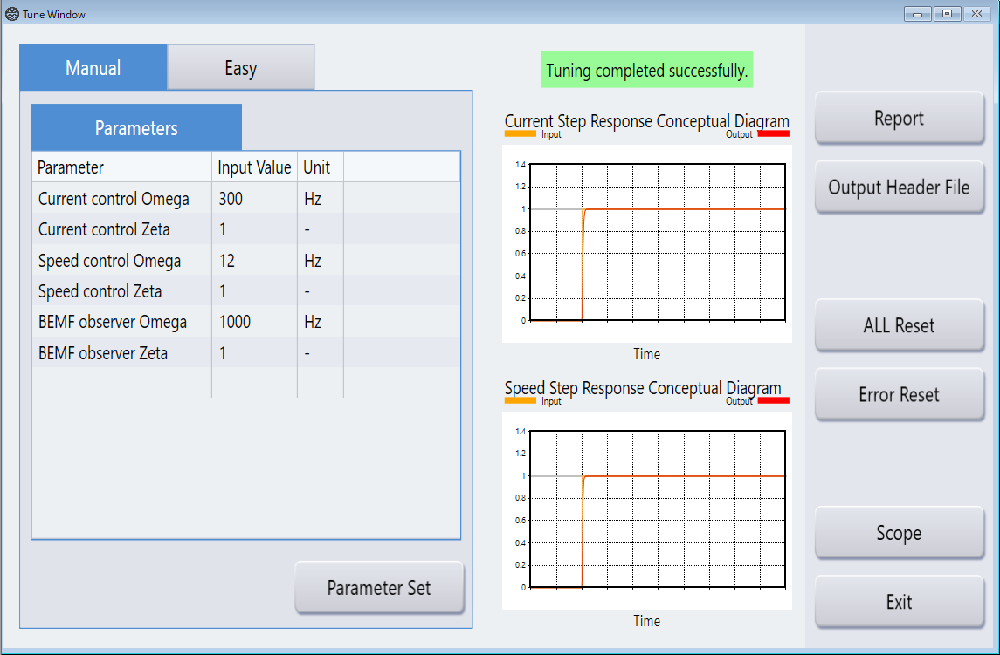
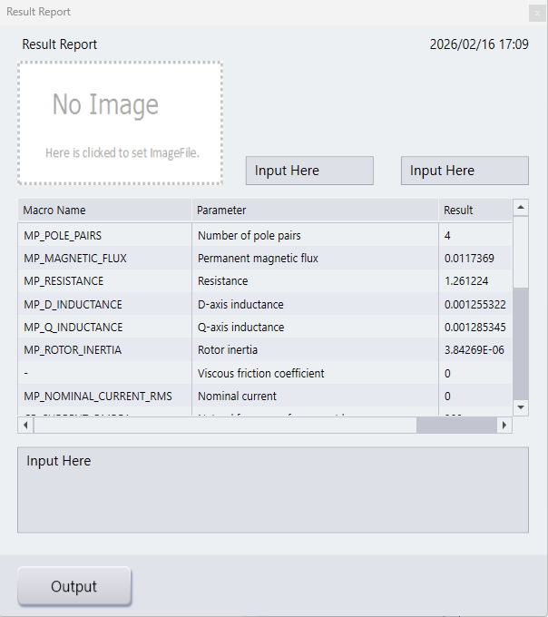

# Tuning Motor Parameter with Tuner Function

## Overview of Tuner Function

Tuner function measures motor parameters (such as R and L) automatically, and tunes
various control parameters (such as PI control gains) required for sensorless control.
If the motor parameter is available from the motor manufacturer, it is recommended
to use those parameters. Motor parameters can also be measured using an LCR meter.
For details, refer to the Motor Parameter section.

## Operation Instructions

This section describes the set-up procedure for motor parameter tuning using the
Tuner function. The overall operation flow is illustrated in the figures referenced
in the following sections.

### 1. Writing the Executable File

1. Use **e² studio** to add the Motor Tuner stack to the **Stacks Configuration**
   in the `configuration.xml` file.
2. Build the project.
3. Run the debugger to write the executable file to the CPU board.

Fig. 1  Adding Motor Tuner Stack in e² studio

### 2. Launching Renesas Motor Workbench

1. Launch **Renesas Motor Workbench**.
2. Load the **RMT file** generated by the build into Renesas Motor Workbench.
3. Choose the COM port connected to the CPU board from the **Connection** tab.
4. Choose the **Tuner** tool from the **Select Tool** tab of Renesas Motor Workbench.

The initial window of Renesas Motor Workbench is shown in Fig. 2.

Fig. 2  Renesas Motor Workbench Start Window

### 3. Execution of Tuning

1. After launching the Tuner tool, the **Parameter Input** screen appears
   (see Fig. 3).

   In the **Input Parameter** section:
   - Enter **Rated Current**
   - Enter **Pole Pairs**

   These values are typically described in the motor specifications or on the motor label.

2. If motor parameters (such as resistance or inductance) are already known,
   they can be excluded from automatic measurement by enabling the corresponding
   items in the **Skip Kind** tab.

3. Press the **Start** button to begin tuning.
   - To stop tuning during execution, press the **Stop** button.
   - If an error occurs, check the displayed error message and press the **Reset** button
     (an example error screen is shown in Fig. 4).

Fig. 3  Tuner Parameter Input Screen

 
Fig. 4  Example of Error Message

### 4. Confirming the Tuning Result

After tuning is finished, the **Tune Window** will appear, as shown in Fig. 5.

1. Press the **Report** button to view the detailed tuning results.
2. If needed, a PDF file containing the tuning results can be generated by pressing
   the **Output** button in the **Result Report** window (see Fig. 6).
3. Tuning results can also be output in header file format used by Renesas motor
   control programs. Pressing the **Output Header File** button in the **Tune Window**
   displays the save dialog for:
   - `r_mtr_control_parameter.h`
   - `r_mtr_motor_parameter.h`

The obtained parameters can be used directly in the motor control software by updating
the corresponding motor parameter and control parameter header files.

Fig. 5  Tune Window

 
Fig. 6  Tuning Result Report Window

## List of Output Parameters

Table 1 lists the parameters that can be obtained using the Tuner function.

Table 1  List of Output Parameters Obtained by Tuner Function

| Macro | Description | Unit |
|---|---|---|
| MP_POLE_PAIRS | Number of pole pairs | - |
| MP_MAGNETIC_FLUX | Permanent magnetic flux | [Wb] |
| MP_RESISTANCE | Resistance | [ohm] |
| MP_D_INDUCTANCE | D-axis inductance | [H] |
| MP_Q_INDUCTANCE | Q-axis inductance | [H] |
| MP_ROTOR_INERTIA | Rotor inertia | [kg·m²] |
| MP_NOMINAL_CURRENT_RMS | Nominal current | [Arms] |
| (N/A) | Viscous friction coefficient | [Nm/(rad/s)] |
| CP_CURRENT_OMEGA | Natural frequency for current loop | [Hz] |
| CP_CURRENT_ZETA | Damping ratio for current loop | - |
| CP_SPEED_OMEGA | Natural frequency for speed loop | [Hz] |
| CP_SPEED_ZETA | Damping ratio for speed loop | - |
| CP_E_OBS_OMEGA | Natural frequency of BEMF observer | [Hz] |
| CP_E_OBS_ZETA | Damping ratio of BEMF observer | - |
| CP_PLL_EST_OMEGA | Natural frequency of PLL speed estimate loop | [Hz] |
| CP_PLL_EST_ZETA | Damping ratio of PLL speed estimate loop | - |
| CP_ID_DOWN_SPEED_RPM | Speed to start decreasing Id (mechanical) | [rpm] |
| CP_ID_UP_SPEED_RPM | Speed to start increasing Id (mechanical) | [rpm] |
| CP_MAX_SPEED_RPM | Maximum speed (mechanical) | [rpm] |
| CP_SPEED_LIMIT_RPM | Over speed limit (mechanical angle) | [rpm] |
| CP_OL_ID_REF | Id reference when low speed | [A] |

